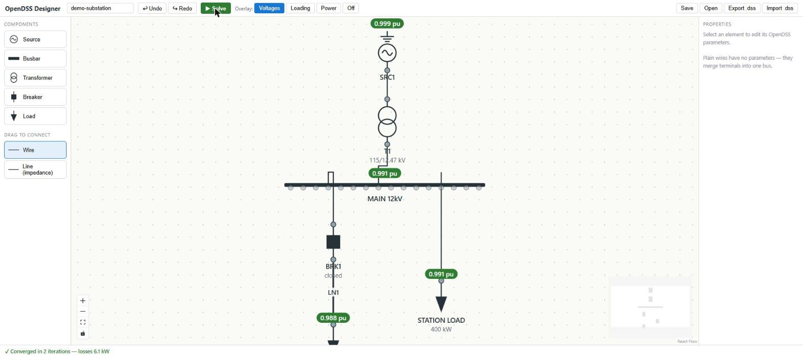

# OpenDSS Designer

A browser-based one-line diagram designer for [OpenDSS](https://www.epri.com/pages/sa/opendss),
built on [OpenDSSDirect.py](https://github.com/dss-extensions/OpenDSSDirect.py).
Draw a substation-style single-line diagram — the drawing **is** the circuit model —
then run a power flow and see voltages and loading right on the diagram.



## Features (v1)

- **Click-and-place palette**: Source (Vsource), Busbar, 2-winding Transformer, Breaker/Switch, Load —
  placement is sticky, so keep clicking to drop several; Esc to stop
- **Drag-to-wire**: drag between terminals; choose **Wire** (ideal connection, merges buses) or
  **Line** (a real OpenDSS Line with impedance and length). Illegal connections (busbar-to-busbar
  wires, self-connections, duplicates) are refused with an explanation
- **Stretchable busbars** with connection points along both edges (top and bottom rows), plus
  implicit junction buses when you wire elements directly together
- **Double-click a breaker** to open/close it; **double-click a wire or line** to add a draggable
  routing point and shape the run yourself (double-click a point to remove it)
- **Properties panel** with the OpenDSS parameters for each element (kV, kVA, impedances,
  phases 1/2/3, wye/delta, load model…)
- **Solve** button → snapshot power flow → overlays on the diagram:
  bus voltages (pu), element loading %, power flows, with color-coded violations
  (undervoltage blue, overvoltage/overload red) and total losses in the status bar
- **Live validation**: unconnected terminals, missing source, islands, duplicate names,
  kV mismatches — errors disable Solve and halo the offending element
- **Spreadsheet view**: an Elements tab in the bottom panel lists every source, busbar,
  transformer, line, breaker, and load in an editable table (plus a read-only bus-results
  table after a solve) — edit values in bulk, click ⌖ to locate an element on the diagram
- **Undo/redo** (Ctrl+Z / Ctrl+Y), delete key, grid snapping, pan/zoom, minimap
- **Save/Open** projects as JSON; **Export** a runnable `.dss` file;
  **Import** existing `.dss` files with automatic layout (tidy it up by dragging)

## Install & run

Requires Python 3.10+. From the repo root:

```bash
pip install -e .
opendss-designer            # starts a local server and opens your browser
```

Options: `--port 8721`, `--no-browser`.

Try it: **Open** `examples/demo-substation.oneline.json`, press **Solve**.

## Development

Backend (FastAPI + OpenDSSDirect.py):

```bash
pip install -e .[dev]
pytest                      # backend test suite
PYTHONPATH=src python -m opendss_designer.cli --no-browser   # serve API + built frontend
```

Frontend (React + Vite + React Flow), in a second terminal:

```bash
cd frontend
npm install
npm run dev                 # http://localhost:5173, proxies /api to :8721
```

To bundle the frontend into the Python package (before building a wheel):

```bash
python scripts/build_frontend.py
```

### Architecture

- `frontend/` — React + Vite app. React Flow canvas with custom ANSI-symbol nodes;
  zustand store is the canonical circuit model (zundo for undo history).
  `window.opendssDesigner` exposes the stores for console scripting.
- `src/opendss_designer/core/connectivity.py` — union-find translation of the drawn graph
  into OpenDSS bus names (wires merge terminals; Line edges are series elements).
- `src/opendss_designer/core/compiler.py` — circuit JSON → ordered OpenDSS Text commands;
  the same commands back both `/api/solve` and `.dss` export.
- `src/opendss_designer/core/engine.py` — solves and extracts per-bus voltages and
  per-element loading through the OpenDSSDirect API. Full rebuild per solve; no engine
  state persists between requests.
- `src/opendss_designer/core/importer.py` — imports `.dss` by compiling it with OpenDSS's
  own parser and reading the model back out.

See `FUTURE_IMPROVEMENTS.md` for the roadmap.
