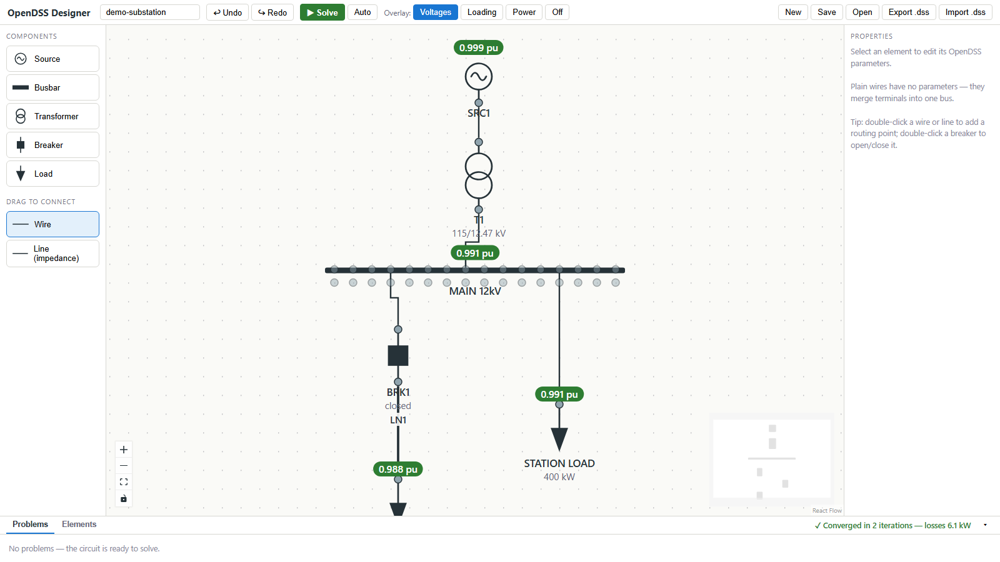

# OpenDSS Designer

**OpenDSS Designer is a free, open-source graphical user interface (GUI) for
[OpenDSS](https://www.epri.com/pages/sa/opendss)**, EPRI's distribution system
simulator. Draw a substation-style one-line diagram in your browser — the
drawing *is* the circuit model — then run a power flow and see bus voltages,
element loading, and violations directly on the diagram.



## Why

OpenDSS is a superb solver with a famously austere front end. If you have ever
wished you could *draw* a feeder instead of scripting it — or hand OpenDSS to a
colleague who doesn't want to learn the DSS command language — this tool is for
you. It is built on [OpenDSSDirect.py](https://github.com/dss-extensions/OpenDSSDirect.py),
so every solve is the real OpenDSS engine, and everything you draw exports to a
plain `.dss` file you can run anywhere.

## Quick start

Requires Python 3.10+.

```bash
pip install opendss-designer
opendss-designer          # starts a local server and opens your browser
```

Run it yourself and everything stays on your machine: the server binds to
`127.0.0.1` and your circuits are never uploaded. (The optional NREL load-profile
and NSRDB irradiance fetchers are the one exception — those reach out to public
data services when you ask them to.) A [hosted demo](deployment.md) is a
different setting with size limits; see [Security](security.md).

Head to [Getting started](getting-started.md) for a walkthrough, or
[Components](components.md) for the full element reference.

## Highlights

- **Draw the circuit**: click-and-place sources, busbars, transformers,
  breakers, loads, capacitors, generators, PV systems, and storage; drag
  between terminals to wire
- **Solve on the diagram**: snapshot power flow with per-bus voltage (pu),
  loading pie charts, power flows, color-coded violations, fault currents,
  and losses — or auto-solve on every edit
- **Time-series simulation**: daily or yearly runs with load, solar, and
  storage-dispatch shapes; scrub or play through the results right on the
  diagram — see [Time-series analysis](timeseries.md)
- **Real-world data**: import NREL/NLR building load profiles by climate zone
  and building type, and NSRDB solar irradiance by location — see
  [Shapes & profiles](shapes.md)
- **Import existing models**: open your current `.dss` files (with
  `redirect`s) and get an automatically laid-out diagram
- **Spreadsheet view**: bulk-edit every element in an Excel-style table with
  fill-down
- **Graphs**: voltage profiles along the feeder, and any recorded quantity
  over simulation time, in the classic OpenDSS plot style
- **Export**: a runnable `.dss` script, byte-for-byte the same commands the
  built-in solver uses

## Open source

AGPL-3.0-licensed, developed on
[GitHub](https://github.com/rsparks3/opendss-designer) — issues and pull
requests welcome. See [Development](development.md) to hack on it.
